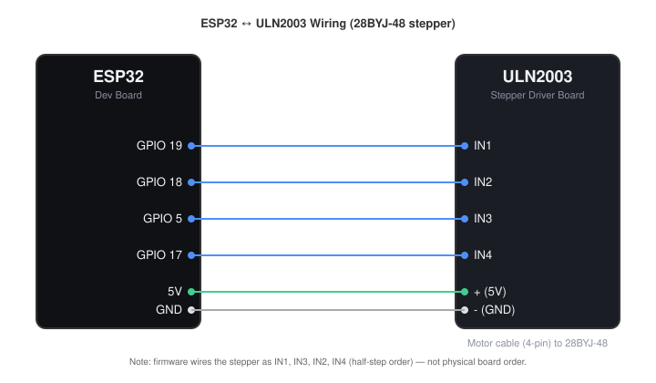

# Automatic Pill & Supplement Dispenser

A cheap, open-source, WiFi-controlled pill dispenser — built to compete with $50-100+ commercial devices using easily sourced electronics and a 3D printer.

## Why

I kept forgetting to take my daily pills and supplements, and every "smart" dispenser on the market was either overpriced, locked behind a subscription app, or both. This project is my answer: a rotating carousel dispenser you control from your phone's browser, no app or account required, built entirely from cheap parts and 3D printed components.

## Features

- **8-slot rotating carousel** — one slot per day (Mon–Sun) plus a dedicated refill slot
- **WiFi controlled** — connect from your phone's browser, no app or account needed
- **ESP32 brains** — cheap, capable, and easy to flash
- **Stepper motor driven** — precise, repeatable carousel rotation
- **Micro USB powered** — plug into any standard USB power source
- **3D printed** — assembles with threaded inserts, no glue required
- **Fully open source** — hardware files, wiring, and firmware all included

## Status

This repo covers the V1 design (USB powered). A V2 battery-powered version is currently in progress — follow this repo for updates.

## Hardware

Full bill of materials with links to where I sourced each part is located in the [BOM V1](BOM%20V1.md) file.

## Wiring



| ULN2003 pin | ESP32 pin |
|-------------|-----------|
| IN1         | 19        |
| IN2         | 18        |
| IN3         | 5         |
| IN4         | 17        |
| + (power)   | 5V        |
| - (ground)  | GND       |

Also connect the ULN2003's 4-pin motor cable to the 28BYJ-48 stepper motor. Note that in firmware the driver is wired as `IN1, IN3, IN2, IN4` (the order `AccelStepper` needs for half-step mode) — that's the physical wiring order above, it just isn't sequential IN1→IN4.

## 3D Printing

STL files are in the `/stl` folder. *(Add recommended print settings: material, layer height, infill, supports needed, print time/cost.)*

## Assembly

*(Add step-by-step assembly instructions or link to a build guide/photos.)*

## Firmware / Setup

1. Install [PlatformIO](https://platformio.org/) (VS Code extension or CLI).
2. Wire the ESP32 to the ULN2003 driver as shown in [Wiring](#wiring) above, and connect the ULN2003's motor cable to the 28BYJ-48 stepper.
3. Copy `include/secrets.h.example` to `include/secrets.h` and fill in your Wi-Fi credentials:

   ```cpp
   const char* WIFI_SSID = "your-wifi-ssid";
   const char* WIFI_PASSWORD = "your-wifi-password";
   ```

   `secrets.h` is git-ignored and will not be committed. Note: the ESP32 only supports **2.4GHz** Wi-Fi networks, not 5GHz.

4. The firmware defaults to the Dallas, TX timezone (`gmtOffset_sec` / `daylightOffset_sec` in `src/main.cpp`). If you're elsewhere, update those values before flashing.
5. Build and upload:

   ```bash
   pio run --target upload
   ```

6. Open the Serial Monitor (115200 baud) to see the ESP32's IP address once it connects to Wi-Fi.
7. Open that IP address in any browser to control the dispenser — no app, no account. From there you can manually rotate the carousel, correct the current day, and set the daily auto-rotation time.

## How It Works

The carousel holds 8 compartments arranged around a central hub. A stepper motor rotates the carousel to align the correct day's compartment with the dispensing opening on a schedule you set through the web interface. The 8th slot is left open for easy refilling without disturbing the weekly rotation. The ESP32 syncs its clock over NTP so the schedule stays accurate, and de-energizes the stepper coils between moves to avoid unnecessary heat/power draw.

## Project layout

```
src/main.cpp                Main firmware (Wi-Fi, web server, stepper control, scheduling)
include/secrets.h           Wi-Fi credentials (git-ignored, create from the .example file)
include/secrets.h.example   Template for secrets.h
platformio.ini               Board/framework config and library dependencies
```

## Dependencies

- [AccelStepper](https://github.com/waspinator/AccelStepper) (`waspinator/AccelStepper@^1.64`)

## Credits

Shoutout to Konrad's original design — the daily-pill-organizer concept was the spark for this project. I wanted to take the idea further with automation, so I designed this from scratch as a motorized, WiFi-controlled version rather than remixing their files. You can check out his project here:

https://makerworld.com/en/models/1323881-supplement-dispenser-pill-dispenser#profileId-1360644

## Contributing

Issues and pull requests welcome — this is an early, actively developed project and feedback is appreciated. This is one of my first projects so some of the code was made with the assistance of AI.
