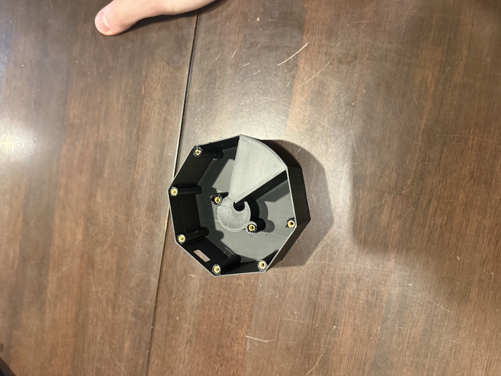
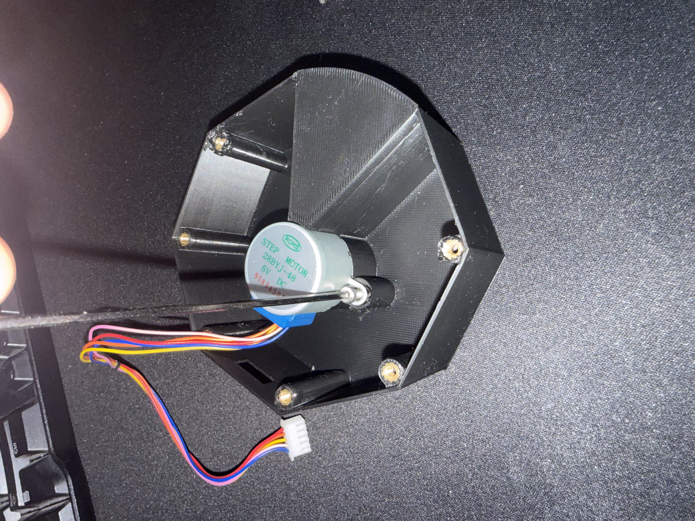
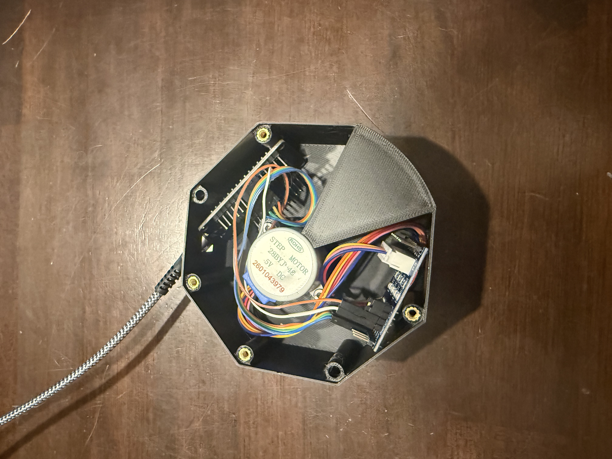

# V1 Assembly

## 1. Print and prepare parts

A. Print out all parts.

B. Install threaded inserts.

   

   - Note: not every single-hole location on the perimeter needs a threaded insert — 4 is enough.
   - Using a dedicated insert press will make this easier.

## 2. Mechanical assembly

A. Mount the motor by driving the side screws into the threaded inserts.

   

B. Attach the carousel.
   - Note: it should sit flush with the base, but may need a little force to seat fully.

## 3. Wiring

A. Connect the stepper motor to the driver.

B. Connect the driver pins to the ESP32 pins.

   

   | ULN2003 pin | ESP32 pin |
   |-------------|-----------|
   | IN1         | 19        |
   | IN2         | 18        |
   | IN3         | 5         |
   | IN4         | 17        |
   | + (power)   | 5V        |
   | - (ground)  | GND       |

   Also connect the ULN2003's 4-pin motor cable to the 28BYJ-48 stepper motor. Note that in firmware the driver is wired as `IN1, IN3, IN2, IN4` (the order `AccelStepper` needs for half-step mode) — that's the physical wiring order above, it just isn't sequential IN1→IN4.

## 4. Firmware

The firmware is a PlatformIO project. You flash it once, and from then on the
ESP32 hosts its own web page that you use to control the dispenser — no app or
account. The only thing you have to personalize before flashing is your Wi-Fi
network and (if you're not in US Central time) your time zone.

### A. Install the tools

1. Install [Visual Studio Code](https://code.visualstudio.com/).
2. In VS Code, open the Extensions panel, search for **PlatformIO IDE**, and
   install it. Let it finish its first-run setup (it downloads the ESP32
   toolchain automatically — this can take a few minutes).
3. Install a USB serial driver if your computer doesn't already see the board:
   - CP2102 boards → Silicon Labs CP210x driver
   - CH340 boards → WCH CH340 driver

   Most DevKit-style ESP32 boards use one of these two chips.

> Prefer the command line? Install the [PlatformIO Core CLI](https://docs.platformio.org/en/latest/core/installation/index.html)
> instead and use the `pio` commands noted in each step below.

### B. Get the project

Download this repository (green **Code → Download ZIP** button on GitHub, then
unzip) or clone it:

```bash
git clone https://github.com/Willykengineering/Automatic-Supplement-Pill-Dispenser.git
```

Open the project **folder** in VS Code (`File → Open Folder…`). PlatformIO will
detect [`platformio.ini`](platformio.ini) and install the one library
dependency (`AccelStepper`) on its own the first time you build.

### C. Enter your Wi-Fi credentials

The project does not ship with a `secrets.h` file — it is git-ignored so
credentials are never committed. Create your own:

1. Copy [`include/secrets.h.example`](include/secrets.h.example) to
   `include/secrets.h` (same folder, drop the `.example`).
2. Open `include/secrets.h` and fill in your network name and password:

   ```cpp
   const char* WIFI_SSID     = "your-wifi-ssid";
   const char* WIFI_PASSWORD = "your-wifi-password";
   ```

   - Use the exact SSID, including capitalization and spaces.
   - The ESP32 radio is **2.4 GHz only**. It cannot join a 5 GHz network. If
     your router broadcasts one combined name for both bands, that's fine — it
     will connect on the 2.4 GHz band.
   - Open networks (no password) and "captive portal" guest Wi-Fi (hotel /
     campus logins) will not work.

### D. Set your time zone (skip if you're in US Central time)

The daily auto-rotation fires on the ESP32's clock, which it syncs from the
internet over NTP. It defaults to US Central time. To change it, open
[`src/main.cpp`](src/main.cpp) and edit these two lines in the `CLOCK` section:

```cpp
const long gmtOffset_sec      = -6 * 3600;   // hours from UTC (standard time)
const int  daylightOffset_sec = 3600;        // 3600 if your region uses DST, else 0
```

Examples:

| Region | `gmtOffset_sec` | `daylightOffset_sec` |
|--------|-----------------|----------------------|
| US Eastern | `-5 * 3600` | `3600` |
| US Central (default) | `-6 * 3600` | `3600` |
| US Mountain | `-7 * 3600` | `3600` |
| US Pacific | `-8 * 3600` | `3600` |
| Arizona (no DST) | `-7 * 3600` | `0` |
| UK | `0 * 3600` | `3600` |
| Central Europe | `1 * 3600` | `3600` |

The "Dallas, TX" label on the web page is only cosmetic — the schedule follows
whatever offset you set here.

### E. Flash the ESP32

1. Plug the ESP32 into your computer with a **data** USB cable (some cables are
   charge-only — if the board never shows up, try another cable).
2. Click the **PlatformIO: Upload** button — the right-arrow (→) icon in the
   blue status bar at the bottom of VS Code. Or run:

   ```bash
   pio run --target upload
   ```

   PlatformIO compiles the firmware and flashes it. The board is `esp32dev` and
   the upload runs at 921600 baud, both already set in `platformio.ini`.
3. If the upload stalls at `Connecting........_____`, hold the **BOOT** button
   on the ESP32 while it says "Connecting", then release once it starts
   writing. Some boards need this every time; many don't need it at all.
4. Wait for `SUCCESS` / `Hard resetting via RTS pin`.

### F. Find the dispenser on your network

1. Open the serial monitor — the **plug** icon in the PlatformIO status bar, or:

   ```bash
   pio device monitor
   ```

   It runs at 115200 baud (already configured).
2. Press the **EN** / **RST** button on the ESP32 to restart it and watch the
   log. You should see:

   ```
   Connecting WiFi...
   .....
   WiFi Connected
   IP Address: 192.168.x.x
   Waiting for time
   Clock Ready
   Web server started
   ```

3. Note the **IP Address**. If it never gets past the dots after
   `Connecting WiFi...`, the SSID/password in `secrets.h` is wrong or the
   network is 5 GHz / a captive portal — fix that and re-flash.

### G. Open the control page

On a phone or computer **connected to the same Wi-Fi network**, open a browser
and go to `http://<the IP address from the serial log>` (for example
`http://192.168.1.42`).

You should see the **Dispenser Control** page with the current time, the
current dispenser day, manual rotation buttons, and a daily schedule field.

- **Set the current day.** Under *Correct Current Day*, choose the day whose
  compartment is lined up with the dispensing opening right now and press
  **Set**. (There are 8 positions: Monday–Sunday plus a Refill slot.)
- **Set the rotation time.** Under *Daily Rotation Schedule*, pick the time you
  want the carousel to advance one day and press **Save**.

> Tip: give the ESP32 a DHCP reservation / static lease in your router so its
> IP address doesn't change. The firmware does not use mDNS, so the numeric IP
> is how you reach it.

## 5. Verification and final assembly

A. Verify the wiring is correct by rotating the motor from the web interface.

B. Place all electronics in the base and screw on the bottom cover.

   

C. Plug the device in at its permanent location and add supplements to the dispenser.
